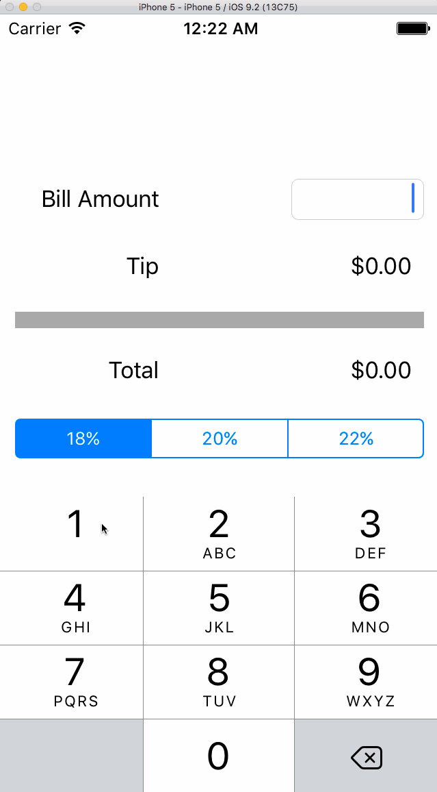

# Simple Tip Calculator

This is an iOS study demo that does a simple tip calculator, created following instructions [here](https://vimeo.com/102084767).

Time spent: 2 hours spent in total

Completed user stories:

 * [x] Required: All functionalities for a basic tip calculator.
 * [x] Optional: I made the tip percentage selection programable by internal class variables, not based on drawing.
 * [x] Optional: I made both Bill Amount input box and tip selector triggers the same onBillEdit function, which make it clear.

GIF created with [LiceCap](http://www.cockos.com/licecap/).
Xingjie Liu
